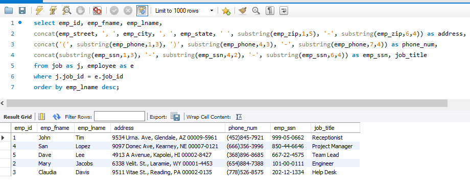

# LIS 3781 - Advanced Database Management

## Jamel Douglas

### Assignment 1 Requirements:

*Five Parts:*

1. Distributed Version Control with Git and Bitbucket
2. Ampps Installation
3. Questions
4. Entity Relationship Diagram and SQL Code
5. Bitbucket repo links
    - This assignment
    - The completed tutorial

> # A1 Database Buisiness Rules
> 
> The human resource (HR) department of the ACME company wants to contract a database
modeler/designer to collect the following employee data for tax purposes: job description, length of
employment, benefits, number of dependents and their relationships, DOB of both the employee and any
respective dependents. In addition, employees’ histories must be tracked. Also, include the following
business rules:
> * Each employee may have one or more dependents.
> * Each employee has only one job.
> * Each job can be held by many employees.
> * Many employees may receive many benefits.
> * Many benefits may be selected by many employees (though, while they may not select any benefits—
any dependents of employees may be on an employee’s plan).
> In addition:
> * Employee: SSN, DOB, start/end dates, salary;
> * Dependent: same information as their associated employee (though, not start/end dates), date added
(as dependent), type of relationship: e.g., father, mother, etc.
> * Job: title (e.g., secretary, service tech., manager, cashier, janitor, IT, etc.)
> * Benefit: name (e.g., medical, dental, long-term disability, 401k, term life insurance, etc.)
> * Plan: type (single, spouse, family), cost, election date (plans must be unique)
> * Employee history: jobs, salaries, and benefit changes, as well as who made the change and why;
> * Zero Filled data: SSN, zip codes (not phone numbers: US area codes not below 201, NJ);
> * *ALL* tables must include notes attribute.

#### README.md file should include the following items:

* Screenshot of ampps installation running
* Git commands with short descriptions
* ERD image
* Bitbucket repo links
    - this assignment
    - completed tutorial repo

#### Git commands w/short descriptions:

1. git init - create new local repo
2. git status - lists changed files in directory
3. git add - add file to next commit
4. git commit - commit changes
5. git push - Upload local changed to remote
6. git pull - Download changes from remote
7. git reset - Discard local changes in directory

#### Assignment Screenshots:

*Screenshot of AMPPS running http://localhost:*

*A1 ERD Image*:

*A1 Exercise Screenshot*:

#### Tutorial Links:

*Bitbucket Tutorial - Station Locations:*
[A1 Bitbucket Station Locations Tutorial Link](https://bitbucket.org/jed18c/bitbucketstationlocations/ "Bitbucket Station Locations")

*My LIS3781 Class Repo:*
[My LIS3781 Class Repo](https://bitbucket.org/jed18c/lis3781/ "My LIS3781 Class Repo")
