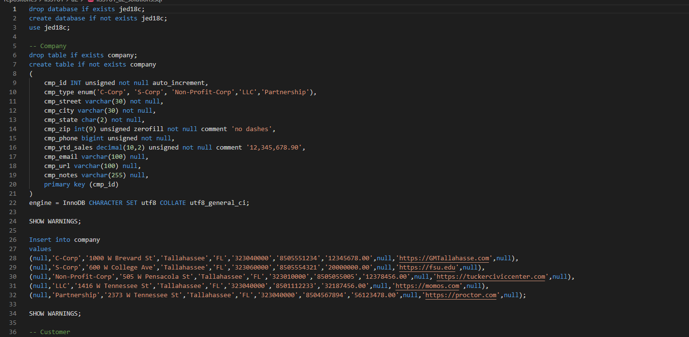
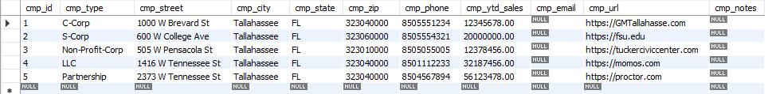
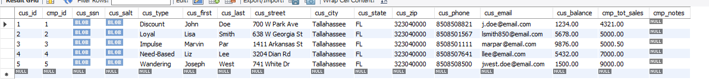

# LIS 3781 - Advanced Database Management

## Jamel Douglas

### Assignment 2 Requirements:

*Two Parts:*

1. MySQL Server
    - Created tables using only SQL
    - Granting Privileges 
2. Bitbucket Repository 

#### README.md file should include the following items:

* Screenshot of sql code
* Screenshot of populated tables

#### Assignment Screenshots:

*Screenshot of SQL Code*:

*Screenshot of populated tables*:

