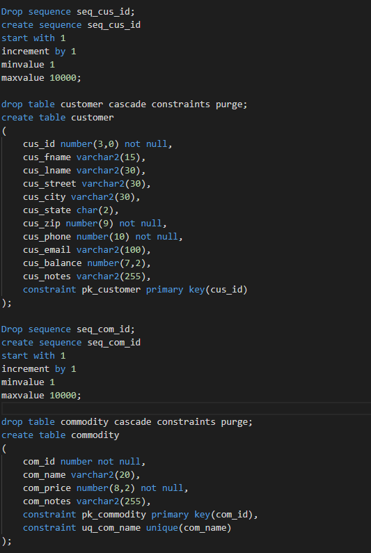
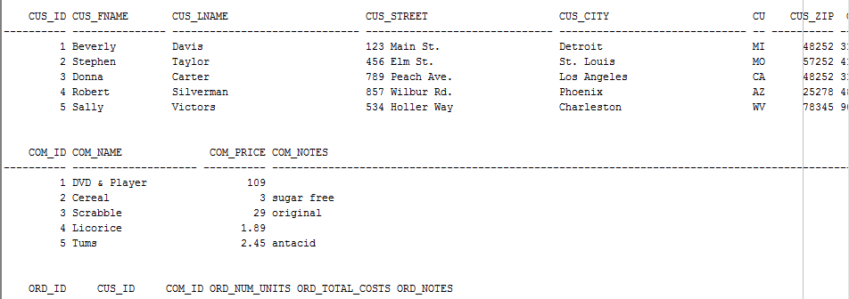

# LIS 3781 - Advanced Database Management

## Jamel Douglas

### Assignment 3 Requirements:

*Two Parts:*

1. RemoteLabs Oracle Server
    - Create and populate tables using sql
    - SQL Solutions (Reports)
2. Bitbucket Repository 

#### README.md file should include the following items:

* Screenshot of sql code
* Screenshot of populated tables
* Optional : SQL code for required reports

#### Assignment Screenshots:

*Screenshot of SQL Code*:

*Screenshot of populated tables*:

