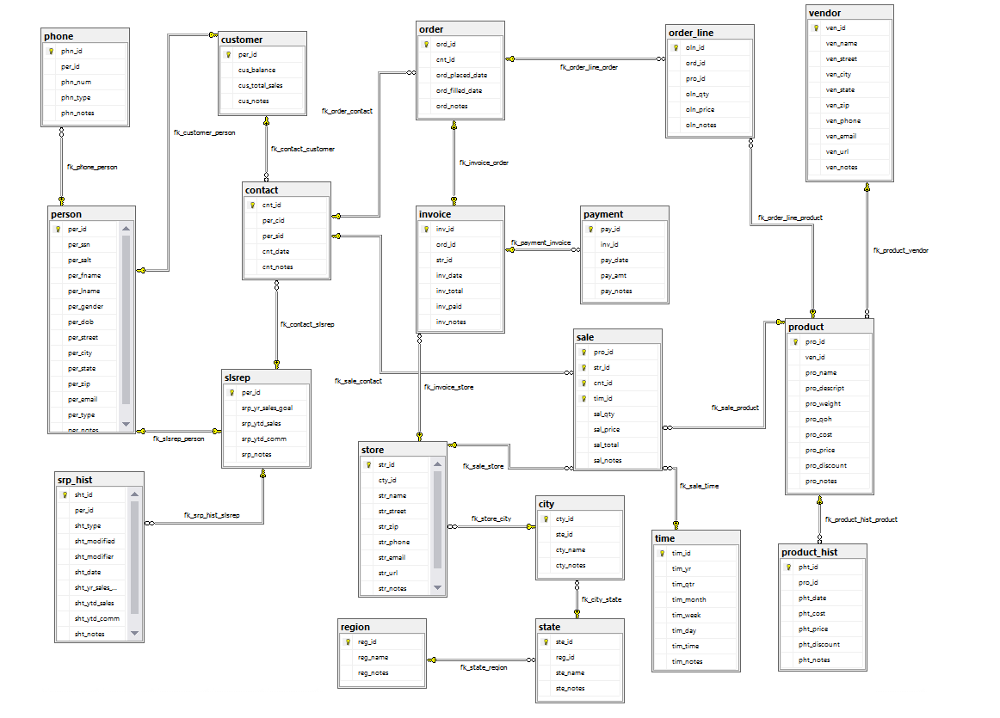

# LIS 3781 - Advanced Database Management

## Jamel Douglas

### Assignment 5 Requirements:

*Two Parts:*

1. MS SQL Server
    - Populate Tables using T-SQL
    - SQL Solutions (Reports)
    - Create ERD
    - Forward Engineer
2. Bitbucket Repository 

> # A5 Database Buisiness Rules
> 
> Expanding upon the high-volumehome office supply company’s data tracking requirements, the CFO requests your services again to extend the data model’s functionality. The CFO has read about the capabilities of data warehousing analytics and business intelligence (BI), and is looking to develop a smaller data mart as a test platform. He is under pressure from the members of the company’s board of directors who want to reviewmore detailed salesreports based upon the following measurements:
> - Product
> - Customer
> - Sales Representative
> - Time (year, quarter, month, week, day, time)
> - Location
> 
> Furthermore, the board members want location to be expanded to include the following characteristics of location:
> - Region
> - State
> - City
> - Store

#### README.md file should include the following items:

* Screenshot of ERD
* Optional : SQL code for required reports

#### Project Screenshots:

*Screenshot of ERD*:

*Screenshot of required reports*:

