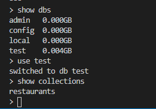
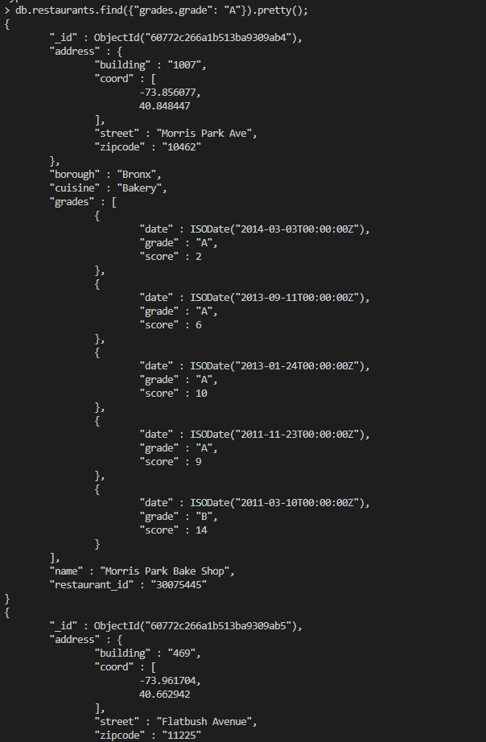

# LIS 3781 - Advanced Database Management

## Jamel Douglas

### Project 2 Requirements:

*Two Parts:*

1. MongoDB
    - Import *primer-dataset.json* using **mongoimport**
    - Run Queries
2. Bitbucket Repository 

#### Queries
Note: *ALL* below queries from restaurants collection in test db.
1. Display all documents in collection.
> db.restaurants.find();
2. Display the number of documents in collection.
> db.restaurants.count();
3. Retrieve 1st 5 documents.
> db.restaurants.find().limit(5);
4. Retrieve restaurants in the Brooklyn borough.
> db.restaurants.find( {"borough": "Brooklyn"} );
5. Retrieve restaurants whose cuisine is American.
> db.restaurants.find( {"cuisine": "American "} );
6. Retrieve restaurants whose borough is Manhattan and cuisine is hamburgers.
> db.restaurants.find( {"borough": "Manhattan", "cuisine": "Hamburgers"} );
7. Display the number of restaurants whose borough is Manhattan and cuisine is hamburgers.
> db.restaurants.find( {"borough": "Manhattan", "cuisine": "Hamburgers"} ).count();
8. Query zipcode field in embedded address document. Retrieve restaurants in the 10075 zip code area.
> db.restaurants.find( {"address.zipcode": "10075"} ); 
9. Retrieve restaurants whose cuisine is chicken and zip code is 10024.
> db.restaurants.find( {"cuisine": "Chicken", "address.zipcode": "10024"} );
10. Retrieve restaurants whose cuisine is chicken or whose zip code is 10024.
> db.restaurants.find({ $or: [ {"cuisine": "Chicken"}, {"address.zipcode": "10024"} ] }); 
11. Retrieve restaurants whose borough is Queens, cuisine is Jewish/kosher, sortby descending order of zipcode.
> db.restaurants.find( {"borough": "Queens", "cuisine": "Jewish/Kosher"} ).sort({"adderess.zipcode": -1});
12. Retrieve restaurants with a grade A.
> db.restaurants.find({"grades.grade": "A"});
13. Retrieve restaurants with a grade A, displaying only collection id, restaurant name, and grade.
> db.restaurants.find({"grades.grade": "A"}, {"name": 1, "grades.grade": 1});
14. Retrieve restaurants with a grade A, displaying only restaurant name, and grade (no collection id):
> db.restaurants.find({"grades.grade": "A"}, {"name": 1, "grades.grade": 1, _id: 0});
15. Retrieve restaurants with a grade A, sort by cuisine ascending, and zip code descending.
> db.restaurants.find({"grades.grade": "A"}).sort({"cuisine":1, "address.zipcode": -1});
16. Retrieve restaurants with a score higher than 80.
> db.restaurants.find({"grades.score": {$gt: 80}});
17. Insert a record with the following data:
    - street = 7th Avenue
    - zip code = 10024
    - building = 1000
    - coord = -58.9557413, 31.7720266
    - borough = Brooklyn
    - cuisine = BBQ
    - date = 2015-11-05T00:00:00Z
    - grade : C
    - score = 15
    - name = Big Tex
    - restaurant_id = 61704627
> db.restaurants.insert(
>    {
>        "address": {
>            "street": "7th Avenue",
>            "zipcode": "10024",
>            "building": "1000",
>            "coord": [-58.9557413, 31.7720266]
>        },
>        "borough": "Brooklyn",
>        "cuisine": "BBQ",
>        "grades": [
>            {
>               "date": ISODate("2015-11-05T00:00:00Z"),
>                "grade": "C",
>                "score": 15
>            }
>        ],
>        "name": "Big Tex",
>        "restaurant_id": "61704627"
>    }
> );

18. Update the following record: Change the first White Castle restaurant document's cuisine to "Steak and Sea Food," and update the lastModified field with the current date.
> db.restaurants.update(
>     {"_id": ObjectId("60772c266a1b513ba9309ace")},
>     {
>         $set: {"cuisine": "Steak and Sea Food"}, $currentDate: {"lastModified": true}
>     }
> );

19. Delete the following records: Delete all White Castle restaurants.
> db.restaurants.remove({"name":"White Castle"});

#### README.md file should include the following items:

* Screenshot of at least one MongoDB shell command(s), (e.g., show collections)
* Optional : JSON code for required reports

#### Project Screenshots:

*Screenshot of MongoDB Shell Command(s)*:

*Screenshot of MongoDB Query*:

